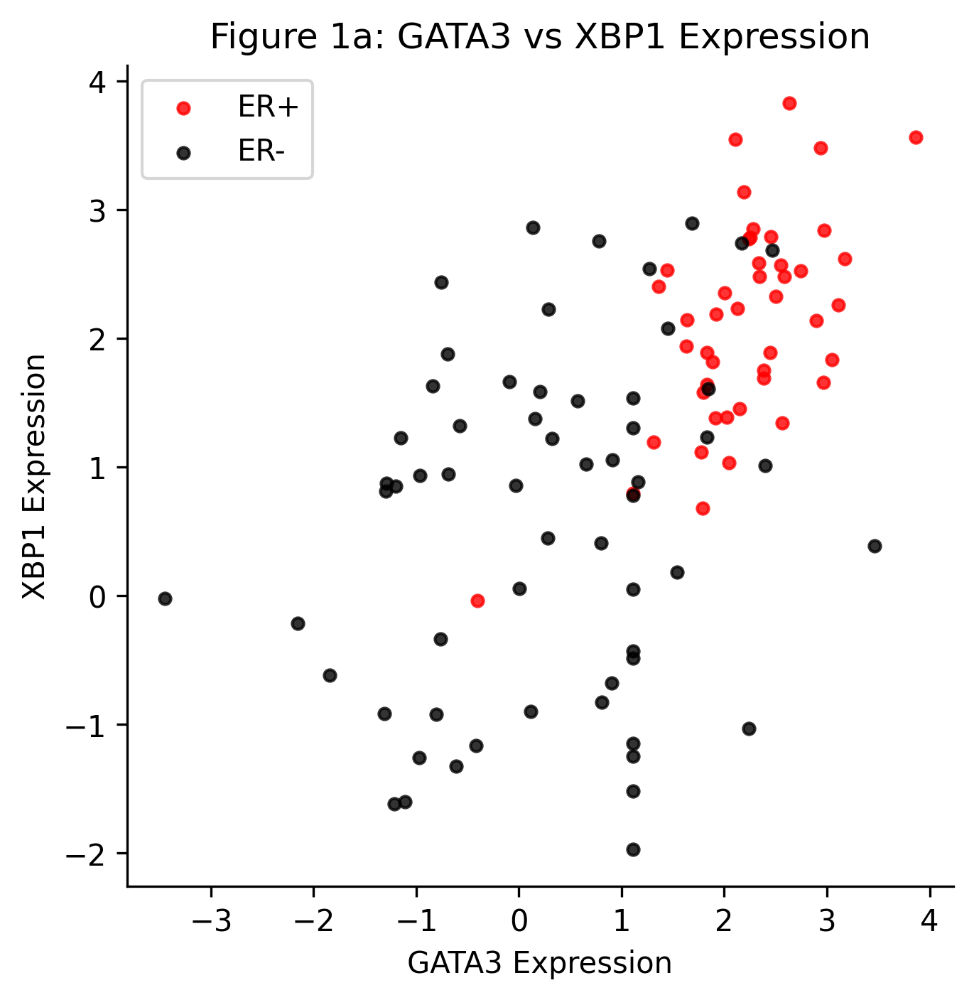
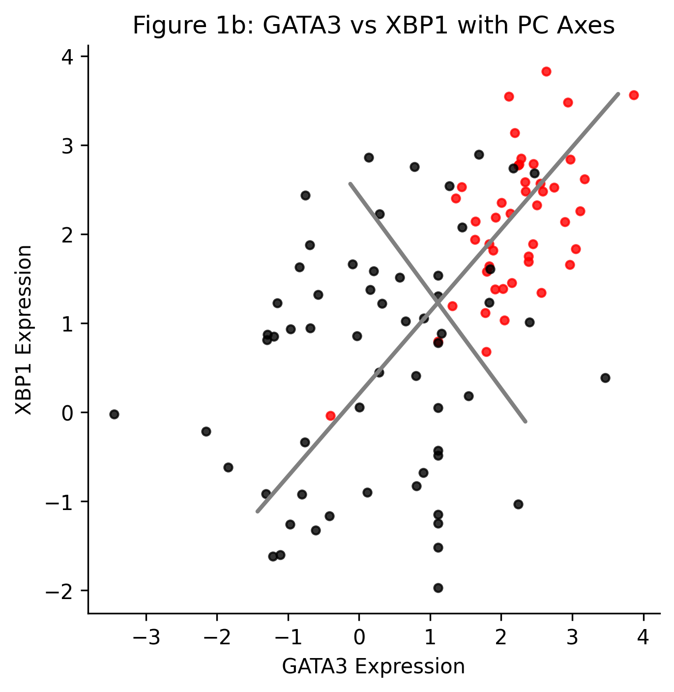
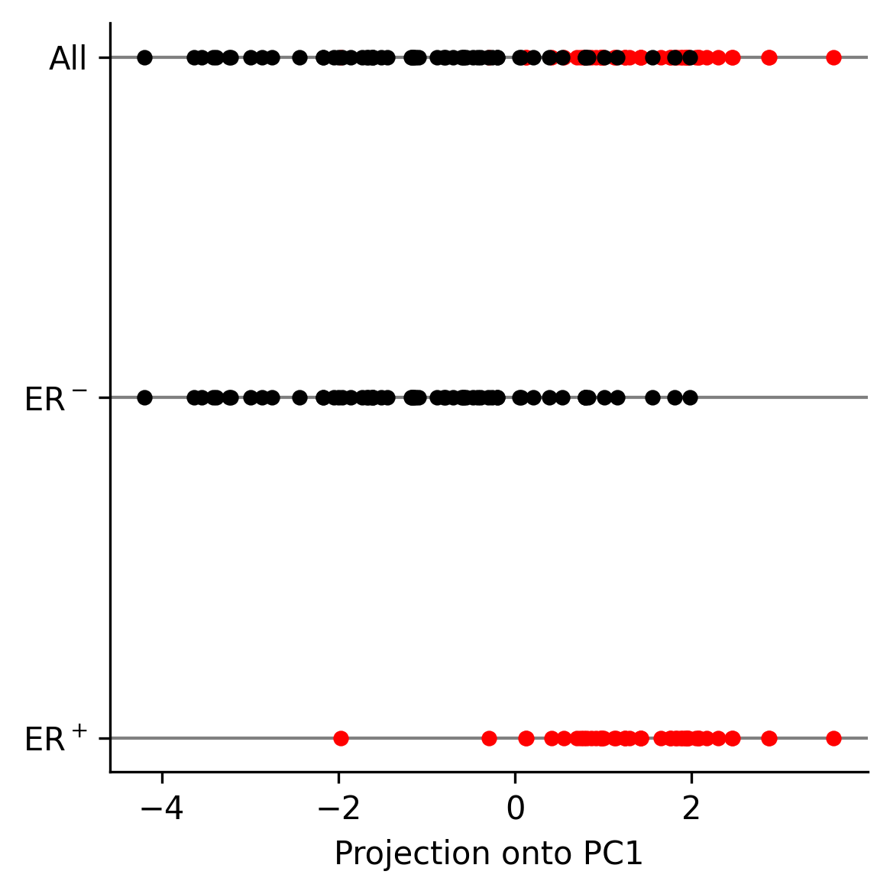

# Principal Component Analysis on Gene Expression Data

## Introduction
In this project, we explored gene expression data from Breast Cancer patients (105 samples) based on the Nature Primer on Principal Component Analysis (PCA). The goal was to extract the expression levels of two specific genes, XBP1 and GATA3, to visualize their relationship and observe how well they can separate the patient samples based on Estrogen Receptor (ER) status (ER+ vs ER-). After that, we applied PCA to this 2-dimensional dataset to project the data onto its first principal component (PC1).

## Methodology
The dataset was provided in three files:
- `class.tsv`: Contains the labels (1 for ER+ and 0 for ER-) for all 105 patients.
- `filtered.tsv.gz`: The complete dataset with patient samples as rows and genes as columns. The first line is the header containing the gene IDs.
- `columns.tsv.gz`: The mapping file where we identified that the ID for the XBP1 gene is **4404**, and the ID for GATA3 is **4359**.

We used Python along with `numpy`, `matplotlib`, and `scikit-learn` to parse the files, extract the relevant data columns, and perform the visualizations and PCA.

## Results

### 1. Scatter Plot (GATA3 vs XBP1)
First, we extracted the expression levels for XBP1 and GATA3 across all 105 patients. The resulting scatter plot (Figure 1a) plots GATA3 expression on the X-axis and XBP1 expression on the Y-axis. The points are colored based on their clinical ER status (Red for ER+, Blue for ER-). 

As seen in the plot, the ER+ and ER- patients naturally form two distinct clusters, indicating that the expression levels of these two genes are highly indicative of the breast cancer sub-type.

### 2. Principal Component Analysis and Explained Variance
To further simplify the data, we ran a Principal Component Analysis (PCA) on this 2D matrix. PCA identifies the directions (principal components) along which the data varies the most. 

The two computed principal components explain the following amount of variance in the data:
- **PC1 Variance**: 77.92%
- **PC2 Variance**: 22.08%

Figure 1b shows the same scatter plot but with the Principal Component axes overlaid. PC1 (explaining ~78% of the variance) is the direction with the maximum spread of the data, while PC2 is orthogonal to it.

### 3. 1D Projection onto PC1
We then transformed the 2D points onto the first principal component (PC1) and generated a 1D projection (Figure 1c).

This 1D plot demonstrates the power of PCA. Even by reducing the dimensions from two to one, we can still clearly separate the ER+ (Red) and ER- (Blue) groups. The variance captured by PC1 maximizes the separation between the classes, showing that PCA is an effective technique for dimensionality reduction.

## Conclusion
By isolating two important biomarker genes (XBP1 and GATA3) from a massive dataset, we successfully reproduced the patterns shown in the Nature Primer. PCA was shown to be an effective method to project the 2D points into a 1D space while retaining the underlying structure that separates ER+ and ER- samples.
